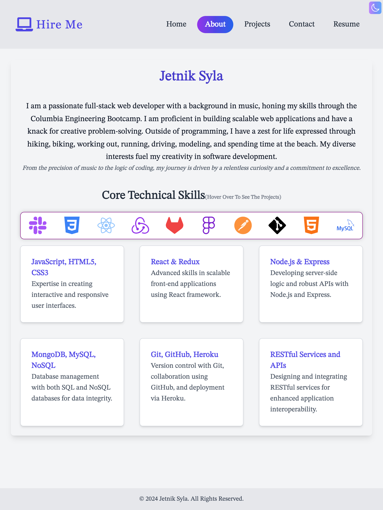

# Jetnik Syla's Portfolio

Welcome to my personal portfolio repository! This site showcases my skills and projects as a full-stack web developer, highlighting my journey from a passionate musician to a dedicated software developer. Built with modern technologies and a clean design, my portfolio offers a comprehensive view of my technical capabilities and project experiences.

## Features

- **Responsive Design**: Provides an optimal viewing experience across various devices.
- **Single-Page Application (SPA)**: Offers a smoother browsing experience with quick transitions.
- **Dynamic Content**: Engages users with interactive elements like animated skills icons.
- **Accessibility**: Navigable and usable by people with disabilities, adhering to WCAG guidelines.
- **Live Project Previews**: Allows visitors to interact directly with my work.
- **Smooth Hover Effects**: Enhances user experience with smooth transitions.

## Technologies Used

- React
- Vite
- CSS3
- JavaScript
- Tailwind CSS

## Sections

1. **Home**: Welcome to my portfolio! Discover my journey and projects, and connect with me.
1. **About Me**: Introduces my background, education, and transition to coding.
1. **Projects**: Demonstrates my projects with details on technologies used and links to GitHub repositories and live sites.
1. **Contact**: Provides methods to connect with me via LinkedIn, GitHub, or email.
1. **Resume**: Offers a downloadable PDF of my professional resume.

## Project Setup

To get this project up and running on your local machine for development and testing purposes, follow these steps:

```bash
npm install
npm start
npm run build
```

## Deployment

This project is deployed on Netlify, facilitating continuous deployment straight from the GitHub repository. Automatic builds ensure that the live site is always up-to-date with the latest changes.

## About the Author

- **Name**: Jetnik Syla
- **Location**: New York
- **GitHub**: [Jetniksyla](https://github.com/Jetniksyla)
- **LinkedIn**: [Jetnik Syla](https://www.linkedin.com/in/jetnik-syla/)

A passionate software developer with a background in music, I have seamlessly transitioned from harmonizing melodies to coding algorithms. My journey from being a clarinetist to a full-stack developer has been fueled by my passion for creating and problem-solving. This portfolio not only showcases my technical skills but also represents my personal growth and dedication.

## Screenshots

Here are some highlights from my portfolio:

**Home:**


**About:**


## Responsive Design

----------------- 

This portfolio is fully responsive and optimized for all screen sizes.

```javascript
screens: {
      ssm: "375px",
      sm: "480px",
      md: "768px",
      lg: "976px",
      xl: "1024px",
      xxl: "1440px",
}
```

## Live Portfolio

Experience my portfolio in action by visiting the following link:

[View Live Portfolio](https://genuine-clafoutis-055e7a.netlify.app/)

## License
[](LICENSE)

This project is licensed under the Apache 2.0 License - see the [Apache 2.0 License](http://www.apache.org/licenses/LICENSE-2.0) file for details.

## Feedback

I value your feedback! If you have suggestions or would like to leave a testimonial, please reach out to me directly at [Jetnik Syla](https://www.linkedin.com/in/jetnik-syla/) or submit via the interactive contact form on my portfolio site.

```

```
